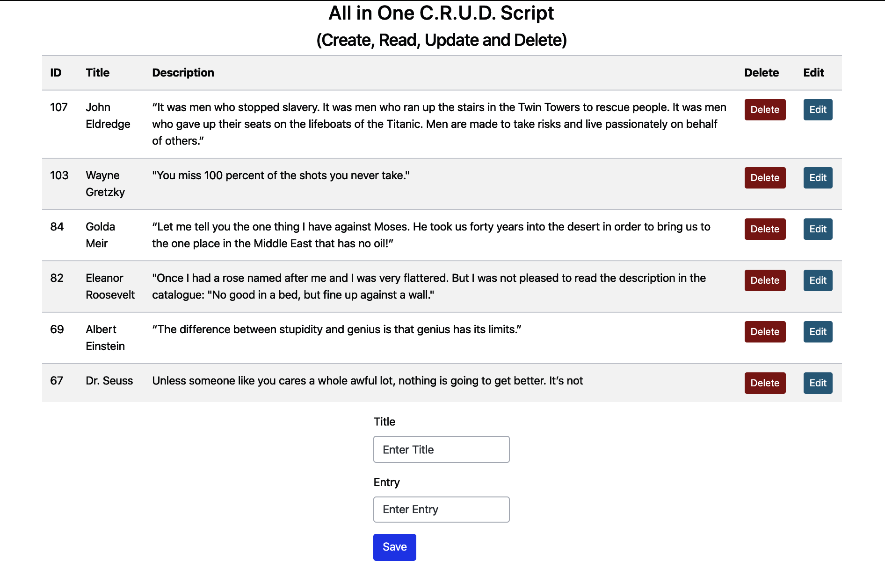
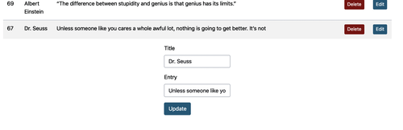
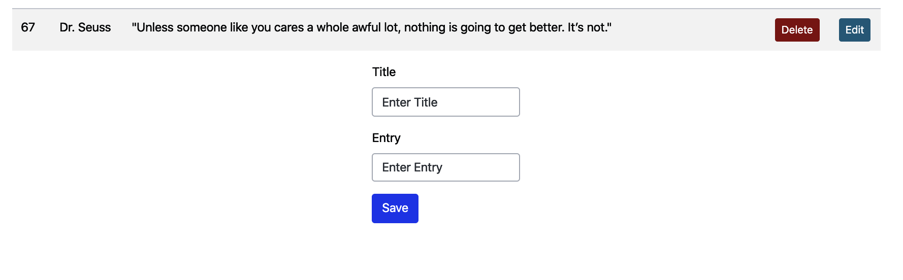

# Single_Page_CRUD
PHP, SQL, PDO Single script. SQL data displays in table. Form usage and buttons change with update and save options.

I needed a single page template that will be easy to adapt and implement into other projects instead of multiple files with redirects. 

Used PDO to handle SQL and provide some security. The PDO configuration is in a separate file.

#### Single page table and form. "Save" button is blue for new entry.

#### After "Edit" button is clicked on the table: the "Update" button appears, and the form populates with information from the table row. 

#### In this case, the  Dr. Seuss reference which was missing quotation marks is edited. After the "Update" button is submitted, the table updates, the form clears, and the button reverts back to the blue "Save" option.

